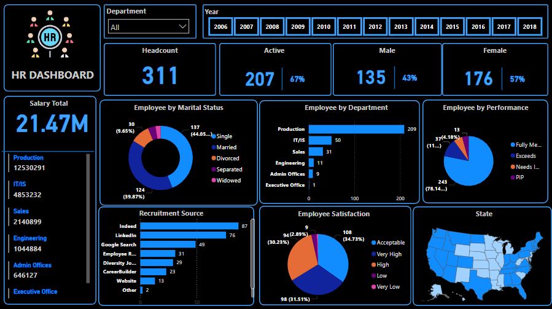

# HR Dashboard

This project is an HR Dashboard built using Power BI, designed to provide a comprehensive overview of a company's workforce. The dashboard serves as a powerful tool for HR managers and business leaders, offering actionable insights for decision-making and workforce planning.

---

## 🧾 Overview

The dashboard visualizes key HR metrics, making it easier to monitor and manage various aspects of the workforce. It enables users to:

- Understand Workforce Size: View total employee count, active employees, and gender distribution.
- Analyze Costs: Examine total salary expenditures and distribution by department.
- Assess Employee Demographics: Understand marital status, departmental distribution, and performance levels.
- Track Recruitment Sources: Identify where new employees are being recruited from.
- Gauge Employee Satisfaction: Analyze employee satisfaction levels.

---

## 🎯 Objectives

1. Informed Decision-Making: Equip HR managers with data-driven insights for hiring, development, and retention strategies.
2. Workforce Planning: Identify skill gaps and plan for future workforce needs.
3. Performance Improvement: Pinpoint areas for enhancing employee performance and satisfaction.
4. Trend Identification: Detect changes in demographics, turnover rates, and other workforce trends over time.

---

## 🔍 Key Features

- Interactive Filtering: Filter data by year or department to get specific insights.
- Performance Metrics: Evaluate employee performance distribution.
- Recruitment Source Insights: Understand where the most effective recruitment sources are.
- Satisfaction Analysis: Visualize satisfaction levels across the organization.
- Salary Breakdown: Analyze salary distribution across departments.
- Geographic Distribution: Explore workforce distribution by location.

---

## 📊 Example Insights

- Which department has the highest number of employees?
- What percentage of employees work in production?
- What is the average salary across departments?
- Where do most hires come from?
- What is the overall level of employee satisfaction?

---

## ⚙ Tools Used

- Power BI: For data modeling, visualization, and interactive dashboard creation.

---

## 🛠 How to Use

1. Open the Power BI file or connect to the published Power BI dashboard link (if available).
2. Use filters (e.g., by department, year) to explore specific data points.
3. Analyze insights and export visuals if needed for reports or presentations.

---

## 🔮 Future Enhancements

This dashboard can be customized further to include additional metrics like:
- Absenteeism rates
- Training costs
- Employee productivity levels
- Turnover trends

---

## 📢 Feedback & Contributions

Feel free to contribute by suggesting improvements or adding new features. For any feedback or questions, please reach out to Farah Osama at farahossama100@gmail.com.
